<div align="center">
  
  <h1>筱和灵眸（AethelEye）</h1>
  <p><strong>拥有AI自进化能力、可托管修改代码，面向电商运营场景的价格监控与告警，可拓展边界满足多样化需求的自动化辅助与治理利器</strong></p>
  <p>
    <a href="LICENSE"></a>
    
    
    
  </p>
</div>

> 本项目为技术学习、架构交流。实际生产请仅在你拥有明确授权的账号、数据和目标页面范围内使用，并遵守适用法律和目标平台规则。

## 项目简介

AethelEye 是一个本地优先的电商价格监控与智能自动化系统。它把任务配置、浏览器采集、价格记录、趋势分析、异动告警、运行管理和 AI 能力整合到同一套 Web 管理界面中。项目的核心亮点是「筱和智眸」与 AI RPA 共同构成的自进化闭环：系统可以从页面视觉探索中形成可复用 Workflow，在页面结构变化时尝试诊断和修复，并通过多层记忆持续积累运行模式、自治决策与实体关系。

## 核心亮点：AI 自进化

AethelEye 的“自进化”不是一句泛化的 AI 口号，而是由源码中的探索、编译、回放、自愈、记忆和健康监控机制共同组成：

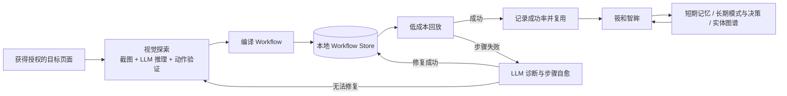

### 视觉探索与 Workflow 编译

AI RPA Explorer 以当前页面截图和最近操作历史作为上下文，由多模态模型判断下一步 `wait`、`click`、`scroll`、`type` 或 `extract` 动作。探索成功后，系统把经过验证的操作序列编译为本地 Workflow，并按平台和 URL 特征保存。

### 回放、评分与选择器自愈

再次遇到匹配页面时，系统优先选择历史成功率较高的 Workflow 回放，持续记录成功与失败次数。当某一步因页面改版或选择器失效而失败时，会截取当前页面交给模型诊断，尝试修正目标选择器或动作并把修复结果写回 Workflow；自愈失败后再回退到完整探索流程，而不是永久依赖一次性的模型输出。

### 「筱和智眸」三层记忆

- 短期记忆：保存最近健康检查、采集事件和临时上下文，支持 TTL 自动过期。
- 长期记忆：沉淀重复出现的模式、历史自治决策和报告摘要，并记录次数、置信度与结果。
- 实体图谱：维护 SKU、店铺、规则、引擎等实体及关联属性，形成可检索的本地知识网络。
- 跨层检索：统一搜索短期记忆、长期模式/决策与实体；有价值的短期记忆可以提升为长期模式。

### 健康监控与分级自治

「筱和智眸」定期汇总任务状态、近期采集成功率、引擎状态、风险信号和系统资源，生成本地报告并写入记忆。它保留全手动、观察、保守和激进四个自治级别；对高风险操作保留人工确认边界，不会因为启用了高级别就自动绕过登录、验证码、访问控制或平台限制。

### 模型路由与能力扩展

不同 AI 服务可以分别绑定。内置工具协议支持查询任务、暂停/恢复任务、调用插件以及生成扩展代码；AI 生成的插件属于可执行代码，启用前必须由管理员审计，插件运行限制也不等同于操作系统级安全沙箱。

## 功能预览

下列图片由全新的本地数据库和虚构示例数据生成，不包含任何真实业务、账号、个人或运营数据。全部截图采用 3200×2200 无损 PNG，并以单张全宽方式展示。

### 数据总览

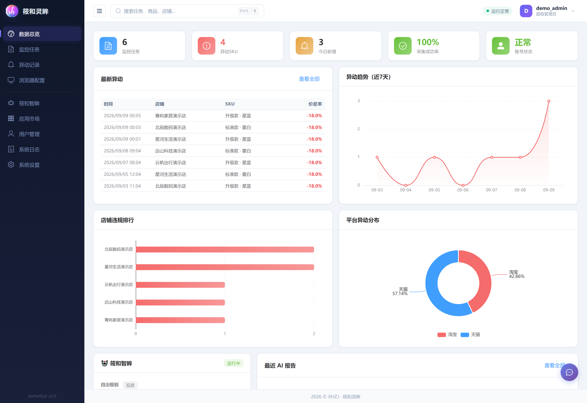

### 监控任务

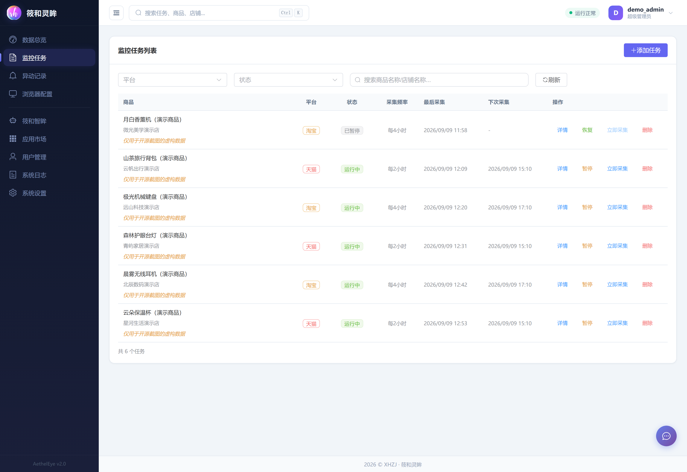

### 异动记录

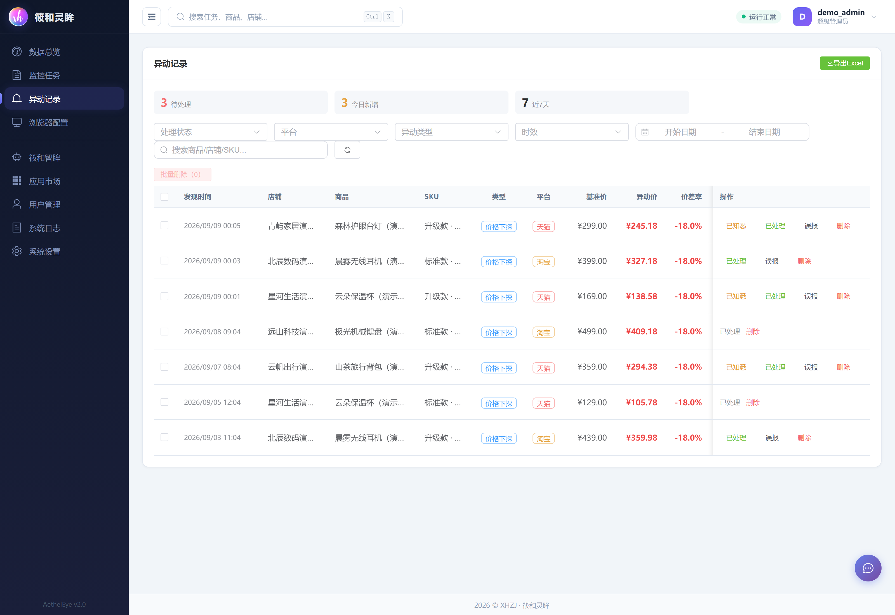

### 浏览器配置

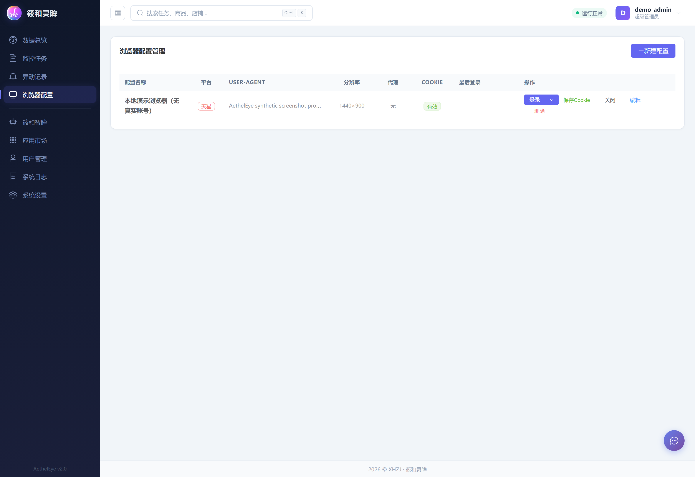

### 筱和智眸

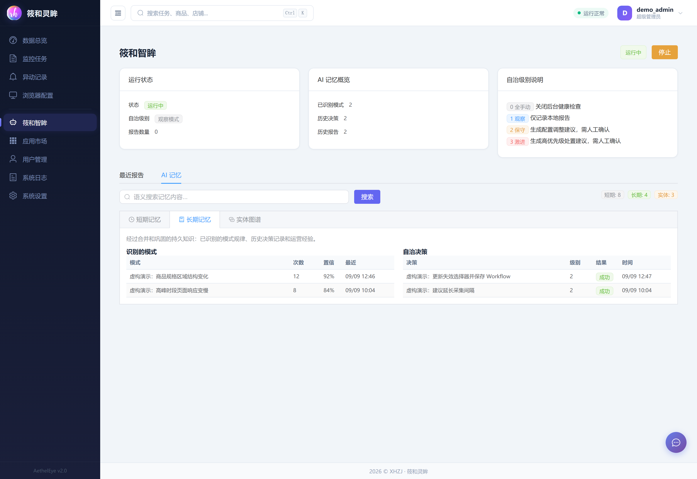

### 应用市场

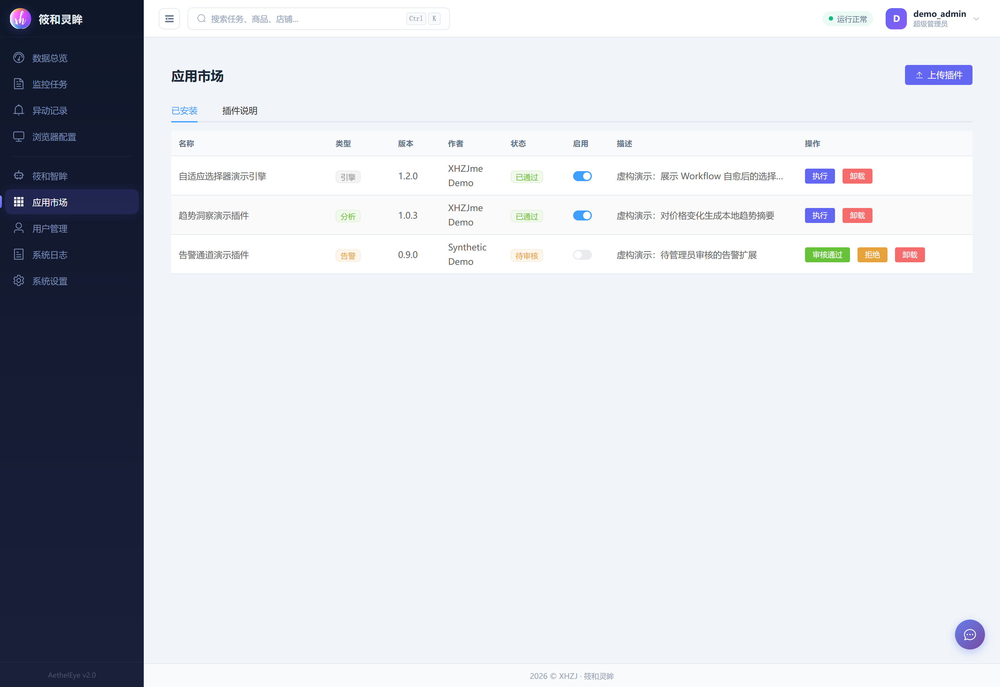

### 用户管理

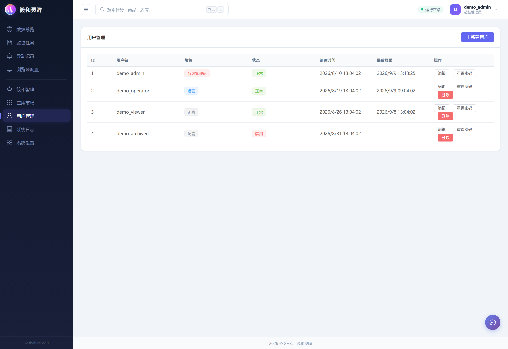

### 系统日志

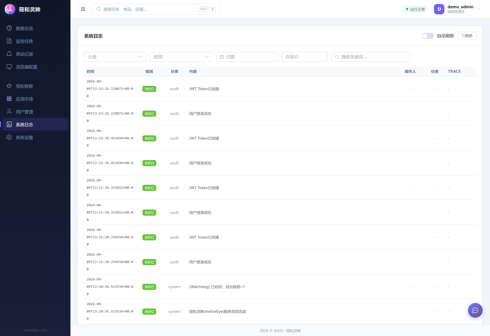

### 系统设置

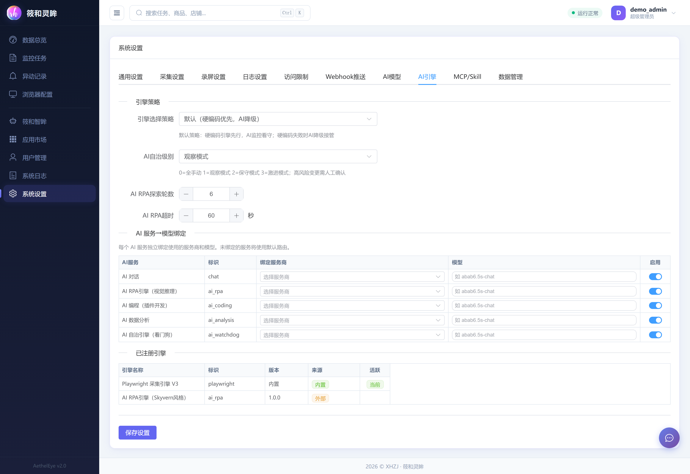

## 主要能力

- AI 自进化：视觉探索、Workflow 编译与复用、成功率评分、失败诊断和选择器自愈。
- 筱和智眸：健康指标监控、分级自治、报告生成、三层记忆、跨层检索与实体图谱。
- 监控任务：维护目标链接、SKU、基准价、执行频率和运行状态。
- 价格采集：通过 Playwright 打开获得授权的页面并记录解析结果。
- 异动识别：当采集价格低于设置阈值时形成异动记录。
- 留痕与回看：按需保存本地截图或录屏，便于排查页面结构变化。
- 告警通知：由使用者自行配置 Webhook；仓库不附带任何地址或密钥。
- 数据分析：Dashboard、趋势图、任务详情、异动汇总与 CSV/XLSX 导出。
- 运行管理：用户与角色、日志、存储空间、浏览器配置、代理配置和计划任务。
- 能力扩展：多模型路由、插件/引擎注册、Skill 管理以及本地 MCP 接口。

## 技术架构

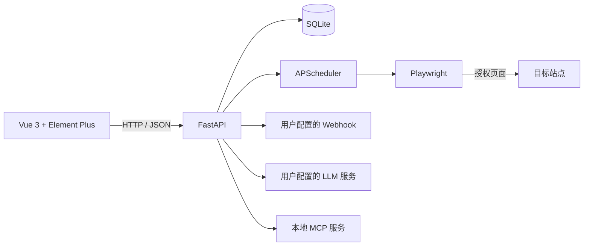

```text
AethelEye/
├─ backend/                 # FastAPI、数据模型、调度、采集与扩展服务
│  ├─ app/
│  ├─ requirements.txt
│  └─ run.py
├─ frontend/                # Vue 3 + TypeScript + Vite 管理界面
│  ├─ src/
│  ├─ package.json
│  └─ vite.config.ts
├─ installer/               # Inno Setup 安装脚本
├─ docs/                    # 公开素材、截图和补充文档
├─ .env.example             # 不含秘密值的配置样例
├─ PRIVACY.md               # 本地数据与外部连接说明
├─ SECURITY.md              # 安全策略与漏洞报告方式
├─ DISCLAIMER.md            # 合规与责任边界
├─ THIRD-PARTY-NOTICES.md   # 直接依赖许可证快照与分发提示
├─ NOTICE                   # 版权与归属通知
└─ LICENSE                  # Apache License 2.0
```

## 快速开始

### 1. 环境要求

- Windows 10/11（核心源码也可在兼容的 Python/Node 环境中运行）
- Python 3.10 或更高版本
- Node.js `20.19+` 或 `22.12+`（Vite 8 的运行要求）
- npm 9 或更高版本

### 2. 获取源码

```bash
git clone https://github.com/XHZJme/AethelEye.git
cd AethelEye
```

### 3. 启动后端

推荐使用独立虚拟环境：

```powershell
python -m venv .venv
.\.venv\Scripts\Activate.ps1
python -m pip install --upgrade pip
pip install -r backend\requirements.txt
playwright install chromium
cd backend
python run.py
```

后端默认仅监听 `127.0.0.1:8686`。API 文档位于 `http://127.0.0.1:8686/docs`。

### 4. 启动前端

另开一个终端：

```powershell
cd frontend
npm ci
npm run dev
```

浏览器访问 `http://127.0.0.1:5173`。首次启动会引导你创建本地管理员账号。

### 5. 构建检查

```powershell
cd frontend
npm run type-check
npm run build
```

完整 Windows 打包流程见 [DEPLOYMENT.md](DEPLOYMENT.md)。公开仓库不提交 `node_modules`、浏览器二进制、数据库或安装包；发布二进制前还应复核所有随包第三方组件的再分发条款。

## 配置与数据边界

| 项目 | 默认值 | 说明 |
| --- | --- | --- |
| `HOST` | `127.0.0.1` | 默认不向局域网或公网暴露服务 |
| `PORT` | `8686` | FastAPI 服务端口 |
| `LOG_LEVEL` | `INFO` | 日志等级；生产环境不建议使用 `DEBUG` |
| `COLLECT_TIMEOUT_SECONDS` | `60` | 单次采集超时 |
| `COLLECT_RETRY_COUNT` | `2` | 失败重试次数，建议保持保守值 |
| `COLLECT_DELAY_MIN_SECONDS` | `5` | 访问间隔下限 |
| `COLLECT_DELAY_MAX_SECONDS` | `12` | 访问间隔上限 |

运行时内容默认位于仓库根目录的 `data/`，并已被 `.gitignore` 整体排除。该目录可能包含：

- SQLite 数据库与本地管理员信息；
- 加密后的账号、Cookie、代理凭据、Webhook 秘密值、MCP 鉴权请求头和 LLM API Key；
- 日志、截图、录屏、插件、AI 记忆和导出文件；
- 启动时自动生成的 JWT 密钥。

即使部分字段已加密，也不要提交、分享或打包真实 `data/` 目录。对外提供截图前，应再次检查页面中的商品名、店铺名、账号、URL、IP、设备信息和时间线。

## 外部连接说明

AethelEye 本身不预置遥测地址，也不会在未配置的情况下把运行数据发送给作者。启用下列功能会产生由使用者发起的外部通信：

- Playwright 访问你配置的目标页面；
- Webhook 接收告警内容；
- OpenAI、Anthropic 或自定义兼容端点接收你主动提交的模型输入；
- GitHub 地址用于下载你主动安装的 Skill 包。

Webhook 地址通常直接包含机器人密钥，因此会与可选签名密钥一起加密落盘，管理接口不会回显原值；MCP 鉴权请求头同样加密保存。第三方插件和 Skill 并不运行在真正的操作系统沙箱中，即使安装接口已有管理员鉴权和 ZIP 路径/体积检查，也只能安装来源可信、固定版本且人工审计过的代码。

详细数据流与操作建议见 [PRIVACY.md](PRIVACY.md)。

## 合规使用

在运行采集任务前，请至少确认：

1. 你对目标账号、页面、数据和自动化操作拥有明确授权；
2. 使用方式符合目标平台服务协议、robots 约定和合理访问频率；
3. 不绕过验证码、登录、访问控制、限流或其他技术保护措施；
4. 不收集与监控目的无关的个人信息，且对必要数据采取最小化、加密和限期保存；
5. 对 Webhook 和 LLM 请求做脱敏，不发送账号凭据、Cookie、个人信息或商业秘密；
6. 在部署或二次发布前，已完成开源依赖、数据保护和安全检查。

更多说明见 [DISCLAIMER.md](DISCLAIMER.md)。这些材料是项目说明，不构成法律意见。

## 开源协议

本项目由筱和致技（XHZJme）开发并持有版权，开源版本采用 [Apache License 2.0](LICENSE)：

```text
Copyright 2025 筱和致技 (XHZJme)
```

Apache-2.0 是宽松型开源协议，包含明确的版权许可、专利许可、NOTICE/署名要求以及免责声明；它允许修改、再分发和商业使用。可同时参阅 [Apache 官方许可证原文](https://www.apache.org/licenses/LICENSE-2.0) 和 [OSI 开源定义](https://opensource.org/osd)。

需要特别说明：真正的开源协议不能把使用范围强制限定为“仅学习”。本项目的发布目的可以写明为学习与交流，但使用者的许可权利最终以 Apache-2.0 正文为准。Apache-2.0 也不授予作者名称、Logo 或商标的额外使用权。

## 贡献与安全

- 贡献方式见 [CONTRIBUTING.md](CONTRIBUTING.md)。
- 安全问题请按 [SECURITY.md](SECURITY.md) 私下报告，不要在公开 Issue 中粘贴密钥、Cookie、数据库或漏洞利用数据。
- 第三方依赖说明见 [THIRD-PARTY-NOTICES.md](THIRD-PARTY-NOTICES.md)。

## 联系作者

以下为 AethelEye 项目作者的联系方式。

| 企业微信 | 微信公众号 |
| --- | --- |
| 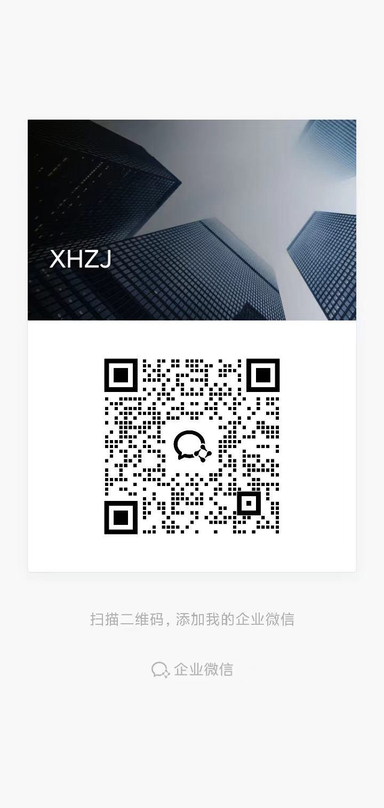 |  |
| 扫码添加企业微信 | 扫码关注微信公众号 |

- GitHub：[@XHZJme](https://github.com/XHZJme)
- 邮箱：[xhzj.me@qq.com](mailto:xhzj.me@qq.com)

## 致谢

感谢 FastAPI、Vue、Element Plus、Playwright、SQLAlchemy、APScheduler、ECharts 及相关开源社区。所有第三方名称与商标归其各自权利人所有。
